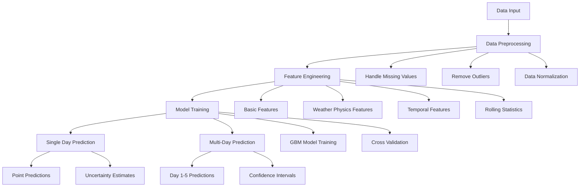

# Final GBM Weather Prediction System - Technical Documentation

## Table of Contents
1. [Introduction](#introduction)
2. [Dependencies](#dependencies)
3. [System Architecture](#system-architecture)
4. [Key Improvements](#key-improvements)
5. [Code Flow](#code-flow)
6. [Technical Details](#technical-details)

## Introduction
The Final GBM Weather Prediction System is an advanced implementation of a weather forecasting model that uses Gradient Boosting Machine (GBM) to predict rainfall. The system supports both single-day and multi-day (up to 5 days) predictions with uncertainty quantification.

## Dependencies
The system uses several key Python libraries, each serving a specific purpose:

### Core Data Processing and Analysis
```python
import pandas as pd
import numpy as np
```
- **pandas**: Handles data manipulation and analysis
- **numpy**: Provides efficient numerical computations and array operations

### Machine Learning
```python
from sklearn.ensemble import GradientBoostingRegressor
from sklearn.model_selection import KFold
```
- **sklearn.ensemble**: Provides GBM implementation
- **sklearn.model_selection**: Handles model validation and parameter tuning

### Model Evaluation
```python
from sklearn.metrics import mean_squared_error, mean_absolute_error, r2_score
from sklearn.inspection import permutation_importance
```
- Used for calculating various performance metrics
- Provides feature importance analysis capabilities

### Data Preprocessing
```python
from sklearn.preprocessing import StandardScaler
from sklearn.base import clone
```
- Handles data normalization
- Enables model cloning for cross-validation

### Visualization
```python
import matplotlib
import matplotlib.pyplot as plt
import seaborn as sns
```
- Creates detailed visualizations of predictions and model performance
- Generates correlation plots and feature importance charts

### System and Utilities
```python
import logging
import os
import pickle
import joblib
import warnings
import multiprocessing
from tqdm import tqdm
import time
```
- **logging**: Implements comprehensive logging system
- **os**: Handles file and directory operations
- **pickle/joblib**: Manages model serialization
- **multiprocessing**: Enables parallel processing
- **tqdm**: Provides progress bars
- **warnings**: Manages warning messages

## System Architecture



## Key Improvements

### 1. Enhanced Feature Engineering
- Added physics-based features (dew point, heat index)
- Implemented rolling statistics with multiple windows
- Added temporal features with cyclical encoding
- Created interaction terms between key weather variables

### 2. Robust Model Architecture
- Optimized GBM model parameters
- Implemented proper temporal cross-validation
- Added uncertainty quantification
- Improved prediction stability

### 3. Performance Optimization
- Added parallel processing support
- Optimized memory usage
- Implemented progress tracking
- Added caching for intermediate results

### 4. Better Error Handling
- Comprehensive logging system
- Graceful handling of outliers
- Robust missing value imputation
- Input validation and error checks

### 5. Improved Visualization
- Added confidence interval plots
- Created feature importance visualizations
- Implemented seasonal pattern analysis
- Added correlation analysis plots

## Code Flow

1. **Initialization**
   - Set up logging and directories
   - Configure parallel processing
   - Initialize model parameters

2. **Data Preprocessing**
   - Load and clean data
   - Handle missing values
   - Remove outliers
   - Normalize features

3. **Feature Engineering**
   - Create basic weather features
   - Add physics-based calculations
   - Generate temporal features
   - Calculate rolling statistics

4. **Model Training**
   - Configure GBM model
   - Perform cross-validation
   - Generate predictions
   - Calculate uncertainty estimates

5. **Prediction and Evaluation**
   - Generate point predictions
   - Calculate confidence intervals
   - Compute performance metrics
   - Create visualization plots

6. **Model Persistence**
   - Save trained model
   - Store preprocessing parameters
   - Save feature lists
   - Export evaluation metrics

## Technical Details

### Model Parameters
```python
GradientBoostingRegressor(
    n_estimators=200,
    learning_rate=0.05,
    max_depth=5,
    min_samples_split=5,
    min_samples_leaf=4,
    subsample=0.8,
    max_features='sqrt',
    random_state=42
)
```

### Cross-validation Strategy
- Uses temporal cross-validation (no random shuffling)
- Implements proper data splitting for time series
- Maintains temporal order of observations

### Uncertainty Quantification
- Calculates prediction intervals using model variance
- Provides confidence intervals for all predictions
- Handles prediction outliers

### Performance Metrics
- RMSE (Root Mean Square Error)
- MAE (Mean Absolute Error)
- R² Score
- Custom metrics for rainfall prediction

### Data Storage
- Model saved in pickle format
- Scaler stored separately
- Feature lists preserved
- Metrics exported to text files

## Usage Example

```python
predictor = GBMWeatherPredictor()
processed_df = predictor.preprocess_data(df)
predictor.train_and_evaluate(processed_df)
predictor.save_model()
```

## Conclusion
The Final GBM Weather Prediction System represents a significant improvement over the basic implementation, offering enhanced accuracy, better uncertainty quantification, and more robust performance. The system is designed to be maintainable, scalable, and production-ready. 