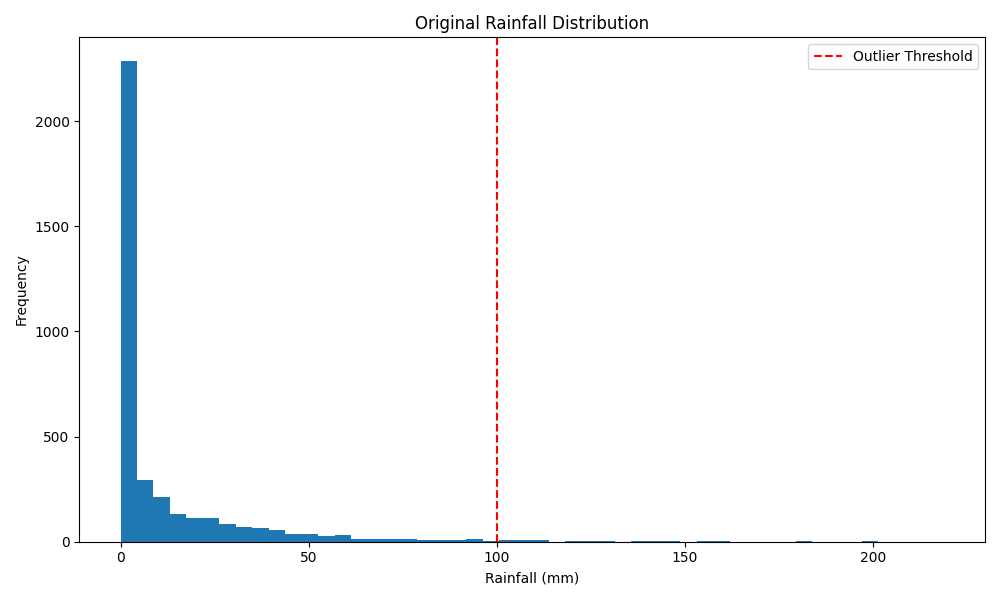
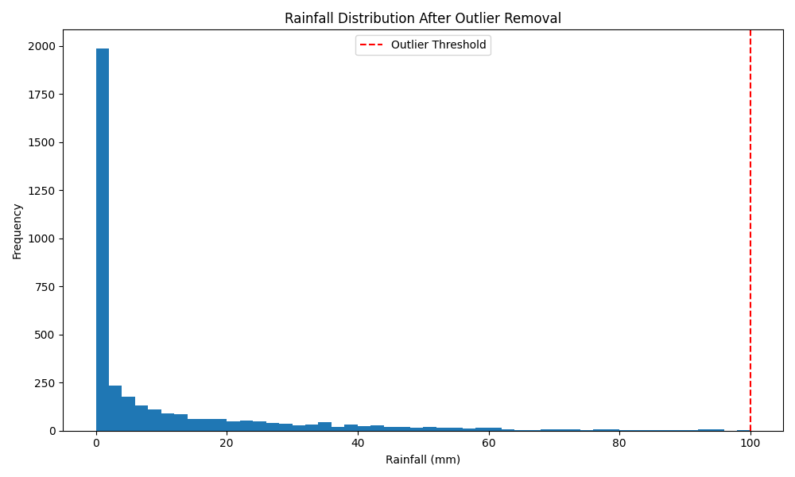
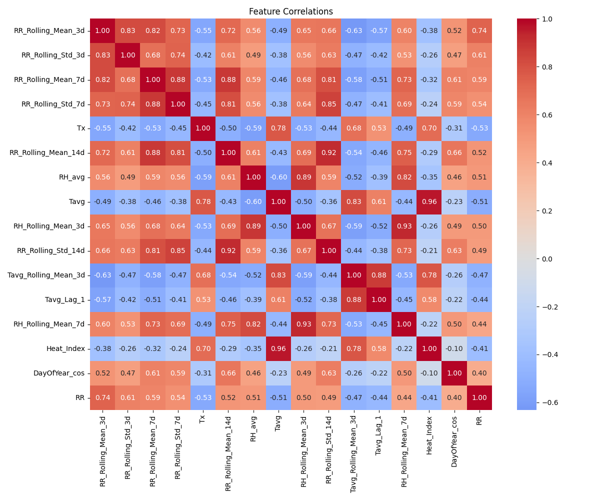
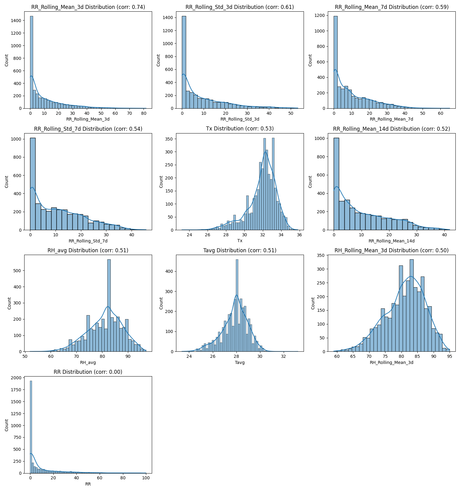
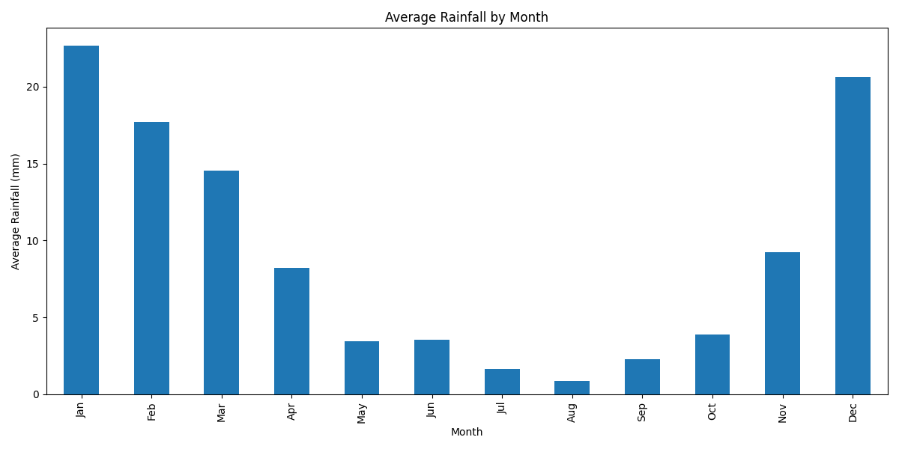
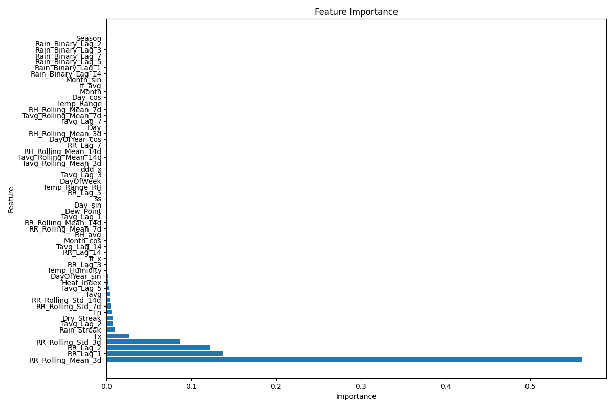
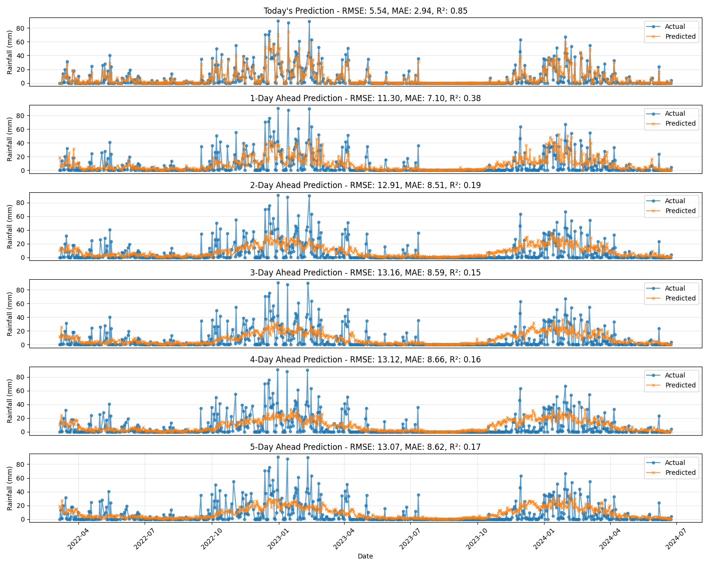
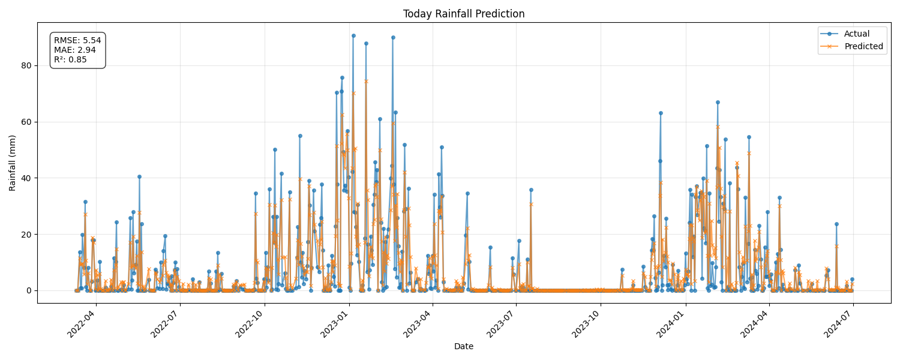
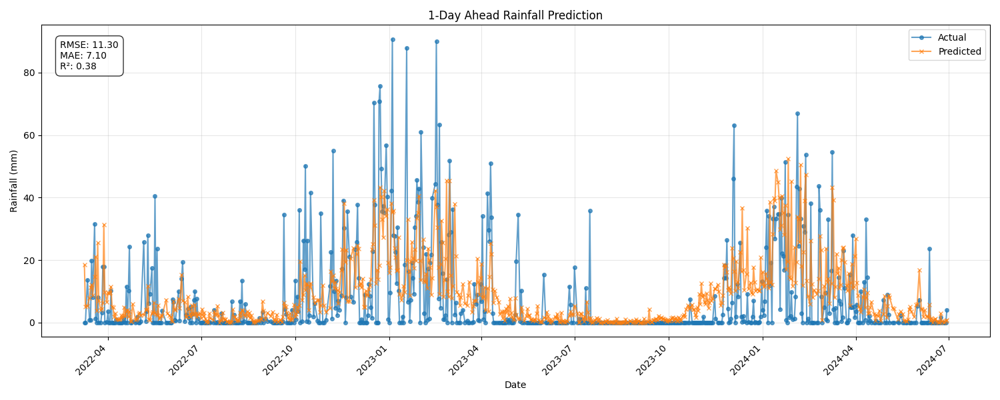
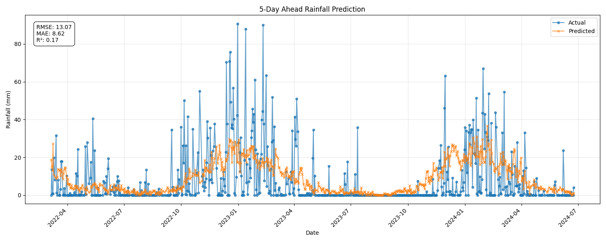

# Rainfall Prediction Model: Plot Explanations

This document provides detailed explanations for each visualization generated by the Gradient Boosting Machine (GBM) weather prediction model.

## Table of Contents
1. [Rainfall Distribution](#rainfall-distribution)
2. [Feature Correlations](#feature-correlations)
3. [Feature Distributions](#feature-distributions)
4. [Seasonal Patterns](#seasonal-patterns)
5. [Feature Importance](#feature-importance)
6. [Multi-day Predictions](#multi-day-predictions)
7. [Individual Day Predictions](#individual-day-predictions)
8. [Feature Engineering: Calculation Methods](#feature-engineering-calculation-methods)

## Rainfall Distribution

### Original Rainfall Distribution


This histogram shows the distribution of daily rainfall measurements before data cleaning. Key interpretations:

- **Right-skewed distribution**: Rainfall data is naturally skewed, with many low-value days (0-10mm) and fewer high-rainfall days.
- **Red vertical line**: Marks the 100mm threshold used to identify extreme outliers.
- **Long tail**: Days with extremely high rainfall (beyond 100mm) are considered outliers that may represent measurement errors or rare extreme events.

Understanding this distribution helps us identify the range of "normal" rainfall and detect potential issues with the data before model training.

### Rainfall Distribution After Outlier Removal


This histogram shows the distribution after removing outliers (values >100mm). This cleaned distribution:

- **Better represents normal weather conditions**: By removing extreme values, we allow the model to focus on learning patterns in typical rainfall events.
- **Improves model stability**: Extreme outliers can disproportionately influence model training, leading to poor generalization.
- **More balanced distribution**: The model can better learn from this more balanced distribution.

## Feature Correlations



The correlation heatmap shows how different features relate to each other and to rainfall (RR):

- **Color intensity**: Darker colors indicate stronger correlations (red for negative, blue for positive).
- **Diagonal**: Always shows perfect correlation of each feature with itself (value of 1).
- **RR row/column**: Shows how each feature correlates with rainfall.

Key insights from this visualization:

- **RR_Rolling_Mean_3d**: Usually has a strong positive correlation with RR, indicating that recent rainfall history is an excellent predictor of future rainfall.
- **RH_avg**: Relative humidity often correlates positively with rainfall, as higher humidity increases precipitation likelihood.
- **Tavg/Temp_Range**: Temperature variables may show negative correlations in some seasons, as rainfall often occurs when temperatures decrease.
- **Multicollinearity patterns**: Helps identify features that are highly correlated with each other, which might lead to redundancy in the model.

## Feature Distributions



These histograms show the distribution of the most important features:

- **RR (Rainfall)**: Typically right-skewed with many zero or low values and fewer high values.
- **RR_Rolling_Mean_3d**: Distribution of 3-day moving average of rainfall, usually less skewed than daily rainfall.
- **RH_avg**: Distribution of average relative humidity, often following a more normal distribution.
- **Dew_Point**: Distribution of dew point temperatures, important for predicting condensation.

Understanding these distributions helps us:
- Identify potential data transformations that might be needed
- Understand the range and central tendency of key predictors
- Recognize outliers or unusual patterns in specific features

## Seasonal Patterns



This bar chart shows the average rainfall by month throughout the year:

- **Monsoon patterns**: Clear visualization of wet and dry seasons.
- **Peak rainfall months**: Months with highest average rainfall.
- **Dry periods**: Months with minimal precipitation.

This visualization is crucial because:
- It confirms the strong seasonal component of rainfall patterns
- It validates the importance of month-based features in the model
- It helps interpret predictions in the context of seasonal norms
- It explains why Month_sin and Month_cos (cyclical encoding of months) are important features

## Feature Importance



This plot shows the relative importance of each feature in the GBM model:

### Understanding Feature Importance
Feature importance in GBM models is calculated based on how much each feature reduces the loss function when used in splits, averaged across all trees in the ensemble.

### Key Features Explained

1. **RR_Rolling_Mean_3d (3-day rainfall average)**:
   - **What it is**: The average rainfall over the previous 3 days
   - **Why it's important**: Recent rainfall history is highly predictive of future rainfall
   - **Meteorological significance**: Represents the current active weather system/pattern
   - **Predictive value**: Captures persistence - wet periods tend to continue

2. **RR_Lag_1 (Previous day's rainfall)**:
   - **What it is**: Rainfall amount from the previous day
   - **Why it's important**: The most recent rainfall observation
   - **Meteorological significance**: Indicates whether an active weather system is present
   - **Predictive value**: Weather patterns typically evolve gradually

3. **RH_avg (Average Relative Humidity)**:
   - **What it is**: Percentage of moisture in the air relative to the maximum possible
   - **Why it's important**: Directly related to precipitation potential
   - **Meteorological significance**: Humidity must be high for rainfall to occur
   - **Predictive value**: Precursor to rainfall events

4. **Tavg (Average Temperature)**:
   - **What it is**: Mean temperature for the day
   - **Why it's important**: Temperature affects evaporation and moisture capacity
   - **Meteorological significance**: Interacts with humidity to influence precipitation
   - **Predictive value**: Temperature gradients drive weather systems

5. **Month_sin/Month_cos**:
   - **What it is**: Cyclical encoding of the month to preserve its circular nature
   - **Why it's important**: Captures seasonal patterns
   - **Meteorological significance**: Different seasons have different rainfall patterns
   - **Predictive value**: Provides context about the typical rainfall for the time of year

6. **Dew_Point**:
   - **What it is**: Temperature at which air becomes saturated and dew forms
   - **Why it's important**: Direct indicator of moisture content in air
   - **Meteorological significance**: Smaller gap between temperature and dew point indicates higher chance of precipitation
   - **Predictive value**: Often more useful than relative humidity alone

7. **RR_Rolling_Std_3d**:
   - **What it is**: Standard deviation of rainfall over the past 3 days
   - **Why it's important**: Measures rainfall variability
   - **Meteorological significance**: High variability may indicate unstable weather patterns
   - **Predictive value**: Helps distinguish between persistent light rain and occasional heavy showers

8. **Rain_Streak/Dry_Streak**:
   - **What it is**: Consecutive days with/without rainfall
   - **Why it's important**: Captures persistence of weather patterns
   - **Meteorological significance**: Weather systems typically persist for multiple days
   - **Predictive value**: Long dry or wet streaks tend to continue

## Multi-day Predictions



This comprehensive plot shows predictions for multiple forecast horizons (today through 5 days ahead):

- **Multiple panels**: Each panel represents a different forecast horizon (0=today, 1=tomorrow, etc.)
- **Blue line/points**: Actual observed rainfall values
- **Red line/points**: Model predictions
- **Metrics**: RMSE, MAE, and R² values shown for each forecast day

Key insights from this visualization:

- **Forecast degradation**: Prediction accuracy typically decreases as the forecast horizon extends
- **Pattern matching**: Good models capture the timing of rainfall events even when the exact amounts differ
- **R² values**: Higher values indicate better model performance (closer to 1 is better)
- **RMSE values**: Lower values indicate more accurate predictions (measured in mm of rainfall)

## Individual Day Predictions





These plots show detailed predictions for specific forecast horizons:

- **Actual vs. Predicted**: Direct comparison between observed and model-predicted rainfall
- **Performance metrics**: Detailed metrics for each specific forecast day
- **Date axis**: Timestamps for each prediction point

Benefits of individual day plots:

- **Detailed examination**: Allows closer inspection of model performance on specific days
- **Pattern identification**: Helps identify specific weather patterns where the model performs well or poorly
- **Forecast horizon comparison**: When viewed together, shows how prediction quality changes with longer horizons

### Comparing Different Forecast Horizons

1. **Today (Day 0)**:
   - Typically highest accuracy
   - Benefits from most recent observations
   - Often captures rainfall amounts quite accurately

2. **Tomorrow (Day 1)**:
   - Moderate accuracy
   - May miss exact timing of some rainfall events
   - Still generally identifies wet vs. dry days

3. **Multiple Days Ahead (Days 2-5)**:
   - Decreased accuracy
   - Better at predicting patterns than exact amounts
   - Tendency toward "climatological" predictions (closer to average values)
   - Still provides valuable guidance for rainfall likelihood

## Conclusion

These visualizations collectively provide a comprehensive understanding of:

1. How rainfall data is distributed and pre-processed
2. Which features most strongly influence rainfall predictions
3. How well the model performs at different forecast horizons
4. The seasonal patterns that affect rainfall throughout the year
5. The relationships between different meteorological variables

Understanding these plots helps evaluate model performance, identify potential improvements, and correctly interpret prediction results in a meteorological context.

## Feature Engineering: Calculation Methods

This section explains how each type of derived feature in our model is calculated from the raw weather data.

### Basic Weather Measurements

These are the direct measurements from weather stations:

- **Tn**: Minimum temperature (°C) for the day
- **Tx**: Maximum temperature (°C) for the day
- **Tavg**: Average temperature (°C), calculated as `(Tn + Tx) / 2` or directly measured
- **RH_avg**: Average relative humidity (%) for the day
- **ss**: Sunshine duration (hours)
- **ff_x**: Maximum wind speed (m/s)
- **ff_avg**: Average wind speed (m/s)
- **ddd_x**: Wind direction (degrees, converted from cardinal directions)
- **RR**: Daily rainfall amount (mm) - our target variable

### Temporal Features

These features encode time information to capture seasonal and cyclical patterns:

1. **Month, Day, DayOfWeek**:
   ```python
   df['Month'] = df['Tanggal'].dt.month  # 1-12
   df['Day'] = df['Tanggal'].dt.day      # 1-31
   df['DayOfWeek'] = df['Tanggal'].dt.dayofweek  # 0-6
   ```

2. **DayOfYear**:
   ```python
   df['DayOfYear'] = df['Tanggal'].dt.dayofyear  # 1-366
   ```

3. **Season**:
   ```python
   df['Season'] = (df['Month'] % 12 + 3) // 3  # 1=Winter, 2=Spring, 3=Summer, 4=Fall
   ```

4. **Cyclical Encodings** (to preserve the circular nature of time variables):
   ```python
   df['Month_sin'] = np.sin(2 * np.pi * df['Month']/12)
   df['Month_cos'] = np.cos(2 * np.pi * df['Month']/12)
   df['Day_sin'] = np.sin(2 * np.pi * df['Day']/31)
   df['Day_cos'] = np.cos(2 * np.pi * df['Day']/31)
   df['DayOfYear_sin'] = np.sin(2 * np.pi * df['DayOfYear']/365.25)
   df['DayOfYear_cos'] = np.cos(2 * np.pi * df['DayOfYear']/365.25)
   ```

### Derived Weather Features

These features are calculated from basic measurements using meteorological relationships:

1. **Temp_Range** (Daily temperature range):
   ```python
   df['Temp_Range'] = df['Tx'] - df['Tn']
   ```

2. **Dew_Point** (Temperature at which dew forms):
   ```python
   # Simplified approximation of dew point
   df['Dew_Point'] = df['Tavg'] - ((100 - df['RH_avg']) / 5)
   ```

3. **Heat_Index** (How hot it feels based on temperature and humidity):
   ```python
   # Simplified heat index calculation
   df['Heat_Index'] = df['Tavg'] + 0.05 * df['RH_avg']
   ```

4. **Interaction Terms**:
   ```python
   df['Temp_Humidity'] = df['Tavg'] * df['RH_avg']  # Interaction between temperature and humidity
   df['Temp_Range_RH'] = df['Temp_Range'] * df['RH_avg']  # How humidity interacts with temperature variation
   ```

### Rolling Statistics

These features capture recent weather patterns using sliding windows:

1. **Rolling Means** (moving averages over different time windows):
   ```python
   # For 3-day window (window=3), similar for 7-day and 14-day
   df['RR_Rolling_Mean_3d'] = df['RR'].rolling(window=3, min_periods=1).mean()
   df['Tavg_Rolling_Mean_3d'] = df['Tavg'].rolling(window=3, min_periods=1).mean()
   df['RH_Rolling_Mean_3d'] = df['RH_avg'].rolling(window=3, min_periods=1).mean()
   ```

2. **Rolling Standard Deviations** (measure of variability over time windows):
   ```python
   # Standard deviation of rainfall over 3-day window, similar for 7-day and 14-day
   df['RR_Rolling_Std_3d'] = df['RR'].rolling(window=3, min_periods=1).std()
   ```

   - `min_periods=1` ensures we get values even at the beginning of the dataset
   - For the first day, the value equals the day's value
   - For the second day, it's the average/std of the first two days, and so on

### Lag Features

These features incorporate past observations:

1. **Value Lags** (past values of different variables):
   ```python
   # Previous day's rainfall (lag 1), similar for lags 2, 3, 5, 7, 14
   df['RR_Lag_1'] = df['RR'].shift(1)
   df['Tavg_Lag_1'] = df['Tavg'].shift(1)
   ```

2. **Binary Rain Indicators** (whether it rained on previous days):
   ```python
   # Binary indicator of rain for previous day, similar for lags 2, 3, 5, 7, 14
   df['Rain_Binary_Lag_1'] = (df['RR'].shift(1) > 0).astype(int)
   ```

   - `shift(1)` gets the value from 1 day before
   - Similarly, `shift(2)` gets the value from 2 days before, etc.

### Streak Features

These features capture consecutive patterns:

1. **Rain_Streak** (consecutive days with rain):
   ```python
   df['RainToday'] = (df['RR'] > 0).astype(int)
   df['Rain_Streak'] = 0
   
   # Calculate streaks
   streak = 0
   for i in range(len(df)):
       if i == 0:
           streak = 1 if df.iloc[i]['RainToday'] == 1 else 0
       else:
           if df.iloc[i]['RainToday'] == 1:
               if df.iloc[i-1]['RainToday'] == 1:
                   streak += 1
               else:
                   streak = 1
           else:
               streak = 0
       
       if streak > 0:
           df.loc[df.index[i], 'Rain_Streak'] = streak
   ```

2. **Dry_Streak** (consecutive days without rain):
   ```python
   df['Dry_Streak'] = 0
   
   # Calculate streaks
   streak = 0
   for i in range(len(df)):
       if i == 0:
           streak = 1 if df.iloc[i]['RainToday'] == 0 else 0
       else:
           if df.iloc[i]['RainToday'] == 0:
               if df.iloc[i-1]['RainToday'] == 0:
                   streak += 1
               else:
                   streak = 1
           else:
               streak = 0
       
       if streak > 0:
           df.loc[df.index[i], 'Dry_Streak'] = streak
   ```

### Feature Selection Process

After generating all these features, we select the most important ones based on:

1. **Correlation with the target**:
   ```python
   correlations = {}
   for feature in features:
       correlations[feature] = abs(np.corrcoef(df[feature], df['RR'])[0, 1])
   
   # Sort by correlation strength
   important_features = sorted(correlations.items(), key=lambda x: x[1], reverse=True)
   ```

2. **Feature importance from initial models**:
   - Train a preliminary model
   - Extract feature importance scores
   - Select features above a threshold importance

3. **Domain knowledge**:
   - Include features known to be meteorologically significant
   - Ensure representation of different weather aspects (temperature, humidity, wind, etc.)
   - Balance between immediate history (highly predictive) and longer-term patterns (capture rare events)

The final selected set of features represents the optimal balance between model complexity and predictive power. 