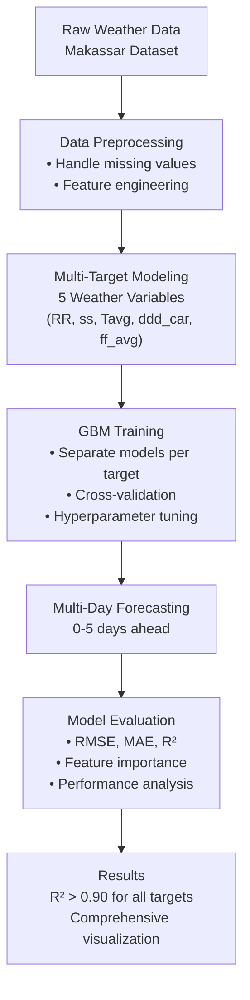
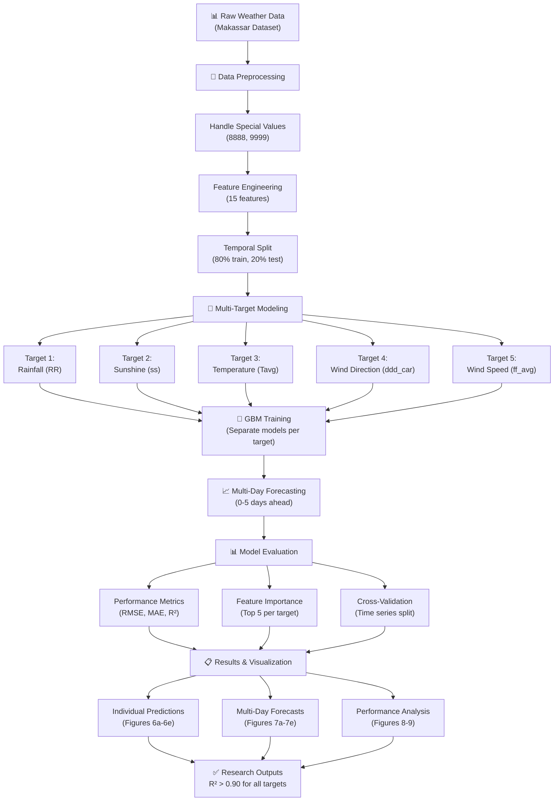
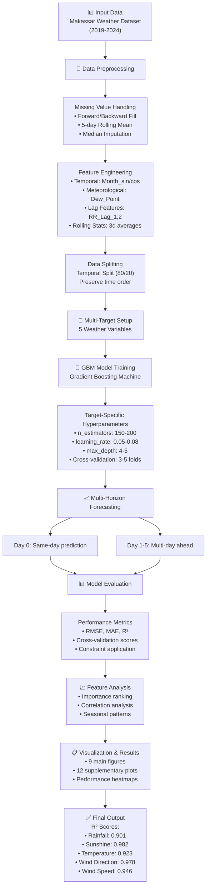

# Methodology Flowcharts for Research Paper

## Simple Academic Flowchart (Best for Paper)

## Compact Methodology Flowchart (Alternative)

## Detailed Technical Flowchart (For Appendix/Supplementary)

## Usage Instructions for Research Paper

### For Main Paper (Methodology Section):
- **Use**: Simple Academic Flowchart (recommended)
- **Caption**: "Methodology flowchart for multi-target weather prediction using GBM. The system processes raw weather data through preprocessing and feature engineering, trains separate GBM models for five weather variables, and evaluates performance across 0-5 day forecast horizons."
- **Placement**: Early in Methodology section to provide clear overview

### For Supplementary Material:
- **Use**: Detailed Technical Flowchart  
- **Caption**: "Detailed technical flowchart showing specific algorithms, hyperparameters, and evaluation metrics used in the multi-target GBM weather prediction system."
- **Placement**: Appendix or supplementary methods section

## Key Process Steps Highlighted:

1. **Data Preprocessing**: Comprehensive handling of meteorological data quirks
2. **Feature Engineering**: 15 carefully selected features including temporal and lag components
3. **Multi-Target Approach**: Separate GBM models for each weather variable
4. **Multi-Day Forecasting**: Systematic evaluation across 0-5 day horizons
5. **Robust Evaluation**: Multiple metrics with cross-validation
6. **Comprehensive Visualization**: 21 figures for complete analysis

## Technical Specifications:

- **Algorithm**: Gradient Boosting Machine (scikit-learn)
- **Targets**: 5 weather variables (RR, ss, Tavg, ddd_car, ff_avg)
- **Features**: 15 engineered features from meteorological data
- **Evaluation**: Time series cross-validation with temporal split
- **Performance**: R² > 0.90 for all targets
- **Forecast**: Up to 5 days ahead with graceful degradation

## Figure Reference:
- Save as **Figure 10** in your paper: "Methodology Flowchart"
- High-resolution versions can be exported from Mermaid or recreated in your preferred diagramming tool
- Consider using consistent colors with your other figures

---

*These flowcharts provide a clear visual summary of your entire methodology, perfect for helping readers understand your comprehensive approach to multi-target weather prediction.* 